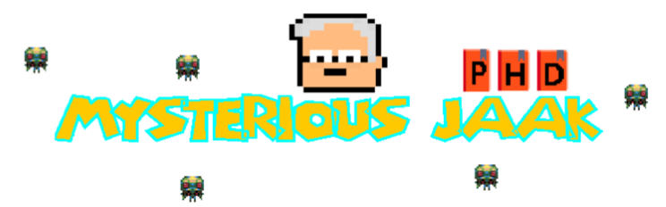

# Algorithmics-project	

Advanced algorithmics course project. University of Tartu 2017

The project shows the application of Particle Swarm Optimization algorithm in practice. For this, the arcade game was implemented using 
[Phaser](https://phaser.io/). The game is playable on different devices with proper scaling.

## The algorithm

PSO is a population based stochastic optimization technique which simulates the social behavior of species in nature. A good example
is a flock of birds or school of fish. PSO is initialized with a group of random particles (solutions) and then searches for optima by
updating generations. All particles have fitness values which are evaluated by the fitness function to be optimized, and velocities which
direct the flying of the particles. The particles fly through the problem space by following the current optimum. In every iteration, each
particle is updated by following two "best" values. The first one is the best solution (fitness) it has achieved so far. This value is
called pbest. Another "best" value that is tracked by the particle swarm optimizer is the best value, obtained so far by any particle in 
the population. This best value is a global best and called gbest. After finding the two best values, the particle updates its velocity and
positions with following equation (a) and (b).

```
v[] = v[] + c1 * rand() * (pbest[] - present[]) + c2 * rand() * (gbest[] - present[]) (a)
present[] = persent[] + v[] (b)
```

v[] is the particle velocity, persent[] is the current particle (solution). pbest[] and gbest[] are defined as stated before. rand () is a
random number between (0,1). c1, c2 are learning factors. usually c1 = c2 = 2. Particles' velocities on each dimension are clamped to a maximum
velocity Vmax. If the sum of accelerations would cause the velocity on that dimension to exceed Vmax, which is a parameter specified by the user.
Then the velocity on that dimension is limited to Vmax.

[Particle Swarm Optimization Visualization](https://www.youtube.com/watch?v=gkGa6WZpcQg)

## The game

The game tells us the story of professor Jaak Villo. Because of the global laziness, students transformed into baddies. Only Jaak can save the
situation, but he has to get Ph.D first. Students don't want this to happen so they try to kill professor. The game consists of two parts: 1) getting of
the Ph.D; 2) saving of the world.

### First part

In the first stage, player needs to collect three books for obtaining of the Ph.D. Each book has the corresponding letter of the "codeword"
(P, H and D respectively) and will spawn randomly after certain amount of time passed. Meanwhile, baddies try to catch professor, using the PSO.
Player has health bar and when point hits the player he loses health. After collection of all of the books Jaak gets Ph.D and the power to tranform
baddies back to normal students, starting the next phase of the game.


### Second part

In the second phase of the game player has to catch all of the baddies and register them to the next Algorithmic course. They try to escape by
following the maximum distance greedy algorithm. The main idea is to choose the direction which maximize the distance to player. The game ends
when player has caught all the baddies. Then the final score is shown, based on the health left and number of baddies caught.


## Future direction

During development process, we were thinking about some nice features, but due to other priorities we had decided to focus on them later.

### Adding timer to the game

Player has limited time to complete the game. If timer ends, current score is shown. In the case when player wins the game before timer ends,
the bonus time is added to the score
  
### Tracking of the global score

Every time player plays the game, his score is saved. Then it is possible to see the leaderboard table.
  
### Adding skills 

In order to bring more fun to the game, the player will be able to use some set of skills, assigned to different buttons. Skills can differ
depending on the phase of the game.