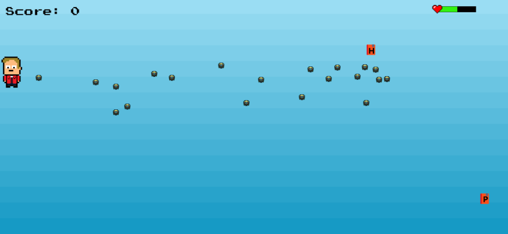

# The Mysterious Jaak	

HTML5 arcade game showing Particle Swarm Optimization algorithm in practice. Built with [Phaser](https://phaser.io/) for
[MTAT.03.238 Advanced Algorithmics](https://courses.cs.ut.ee/2017/algorithmics/fall) course project at [University of Tartu](https://www.cs.ut.ee/en).

## Getting started

Clone and open index.html in browser.

```
git clone https://github.com/kopylash/algorithmics-project.git
```
Or play [here](https://kopylash.github.io/algorithmics-project/).

## Algorithm

PSO is a population based stochastic optimization technique which simulates the social behavior of species in nature. A good example
is a flock of birds or school of fish. PSO is initialized with a group of random particles (solutions) and then searches for optima by
updating generations. All particles try to optimize fitness function. They explore solution space moving to the current known optimum. In every iteration, each
particle velocity is recalculated based on two "best" values. The first one is the best fitness achieved by particle itself. This value is
called `pbest`. Second one is the best fitness achieved by swarm in total, called `gBest`. It represents the concept of shared memory in population.
After finding these two values, particle updates its velocity and positions with following equations (a) and (b).

```
a) v[] = v[] + c1 * rand() * (pbest[] - present[]) + c2 * rand() * (gbest[] - present[])
b) present[] = persent[] + v[]
```

`v[]` is the particle velocity, `persent[]` is the current particle position (solution). `pbest[]` and `gbest[]` are defined as stated before. `rand()` is a
random number between (0,1). `c1, c2` are learning factors. usually `c1 = c2 = 2`. Particles' velocities on each dimension are clamped to a maximum
velocity `Vmax`. If the sum of accelerations would cause the velocity on that dimension to exceed `Vmax`, which is a parameter specified by the user.
Then the velocity on that dimension is limited to `Vmax`.

**PSO examples**
* https://youtu.be/M028vafB0l8
* https://www.youtube.com/watch?v=gkGa6WZpcQg

## Game


The game tells us the story of young Jaak. Because of the global laziness, students transformed into baddies. 
Only Jaak can save the situation, but he has to get the Ph.D first.
Students don't want this to happen so they are trying to catch him (using Particle Swarm Optimization) and make Jaak lazy. 
The game consists of two phases: getting of the Ph.D and saving of the world.


*PSO in action*


*Baddies escape following the maximum distance greedy algorithm*

## Credits

A lot of assets taken from different resources related to game development.

* Icons made by [Freepik](https://www.flaticon.com/authors/freepik) from www.flaticon.com
* Icons made by [yoman5674](http://piq.codeus.net/u/yoman5647) from www.piq.codeus.net
* Sprites taken from [Phaser examples](https://phaser.io/examples)
* Sounds from [The Mushroom Kingdom](http://themushroomkingdom.net/media/smb/wav)
* Victory sound from [OpenGameArt.Org](https://opengameart.org/content/8-bit-victory-loop)
* [PressStart2P](http://www.fontspace.com/codeman38/press-start-2p) and [Super Mario Brothers](http://www.fontspace.com/the-liquid-plumber/super-mario-brothers) fonts from www.fontspace.com

Thanks for inspirations to [Cult of the Party Parrot](http://cultofthepartyparrot.com/), [Sabaton](https://www.sabaton.net/) and sleepless nights.


